# **Reportes de inventario**

Esta página reúne el detalle de los reportes incluídos en la categoría de inventario en el sistema **ContaPortable**.

<!-- Se agrega el código mermaid para diagramar las subcategorías de inventario -->
!!! tip "Diagrama de las subcategorías contenidas en **Reportes de inventario**"
    ``` mermaid
    graph TD
      A[Reportes de inventario]:::root

      subgraph "Subcategorías"
        B[1. Movimientos]
        C[2. Documentos de inventario]
        D[3. Inventario costeados]
        E[4. Por marca y modelo]
      end

      A --> B
      A --> C
      A --> D
      A --> E

    click B "#1-movimientos" "Ir a movimientos"
    click C "#2-documentos-de-inventario" "Ir a documentos de inventario"
    click D "#3-inventario-costeados" "Ir a inventario costeado"
    click E "#4-por-marca-y-modelo" "Ir a reportes por marca y modelo"
    ```
---

!!! warning "**Recálculo de costos**"
    Es importante tomar en cuenta realizar el recálculo de costos, esto se puede realizar por medio del botón que **se señala en la imagen adjunta**, con esto se habilitará la opción **"Imprimir"**
    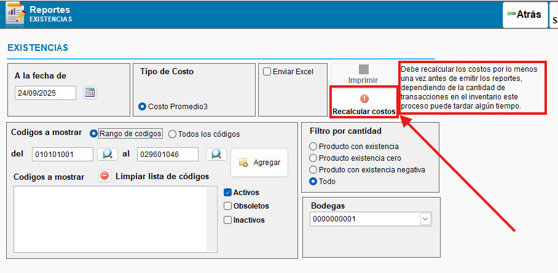{ .align=left }

---

## **1. Movimientos**

<!-- Se agrega el código mermaid para diagramar el listado de reportes dentro de la subcategoría de movimientos -->
!!! tip "Diagrama de los reportes contenidos en la subcategoría **Movimientos**"
    ``` mermaid
    graph LR
      A[Movimientos]:::root

      subgraph "Listado de reportes:"

        B[1.1 Existencias]
        C[1.2 Listado para inventario]
        D[1.3 Listado por categorías]
        E[1.4 Salidas por clientes]
        F[1.5 Existencias - Alerta de mínimos]
      end

      A --> B
      A --> C
      A --> D
      A --> E
      A --> F

    click B "#11-existencias" "Ir a reporte de existencias"
    click C "#12-listado-para-inventario" "Ir a reporte de listado para inventario"
    click D "#13-listado-por-categorias" "Ir a inventario costeado"
    click E "#14-salidas-por-clientes" "Ir a reportes por marca y modelo"
    click F "#15-existencias-alerta-de-minimos" "Ir a reportes por marca y modelo"
    ```
---

### 1.1  Existencias

!!! info "Descripción del reporte"
    Este reporte muestra las existencias para los códigos de inventario, Puede ser filtrado por medio de los siguientes parámetros:

    - Fecha
    - Código (Todos o bloques)
    - Bodega 

    Es posible exportarlo a formato Excel, ya sea de forma consolidada o detallada (Plano).

Vista previa del reporte **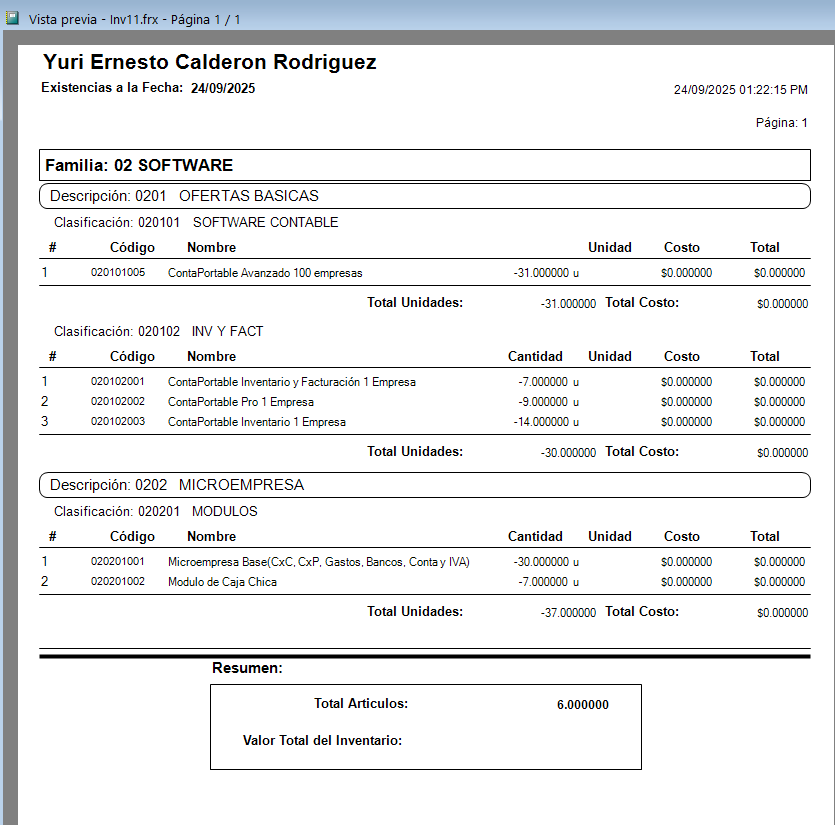{ align=left }**

??? abstract "1.1 Existencias - Descargas de ejemplo"
    - **[Descargar versión PDF :fontawesome-regular-file-pdf:](../../assets/reportes/inventario/1.1-EXISTENCES-REPORT.PDF){ .md-button }**
    - **[Descargar versión Excel (Consolidado) :material-microsoft-excel:](../../assets/reportes/inventario/1.1-EXISTENCES-REPORT_CON.xlsx){ .md-button }**
    - **[Descargar versión Excel (Plano) :material-microsoft-excel:](../../assets/reportes/inventario/1.1-EXISTENCES-REPORT_Pln.xlsx){ .md-button }**

Puedes encontrar más información en el sitio oficial de **ContaPortable** **[Enlace en sitio ContaPortable :material-web:](https://www.contaportable.com/indice/vip-modulo-contable-reportes-contables/reporte-inventario-y-facturacion/#existencia){ .md-button align=left }**

---
### 1.2  Listado para inventario

!!! info "Descripción del reporte"
    Este reporte muestra un formato apto para la toma de inventario, puede ser filtrado por medio de los siguientes parámetros:

    - Fecha
    - Código (Todos o bloques)
    - Bodega 

    Es posible exportarlo a formato Excel, ya sea de forma consolidada o detallada (Plano).

Vista previa del reporte **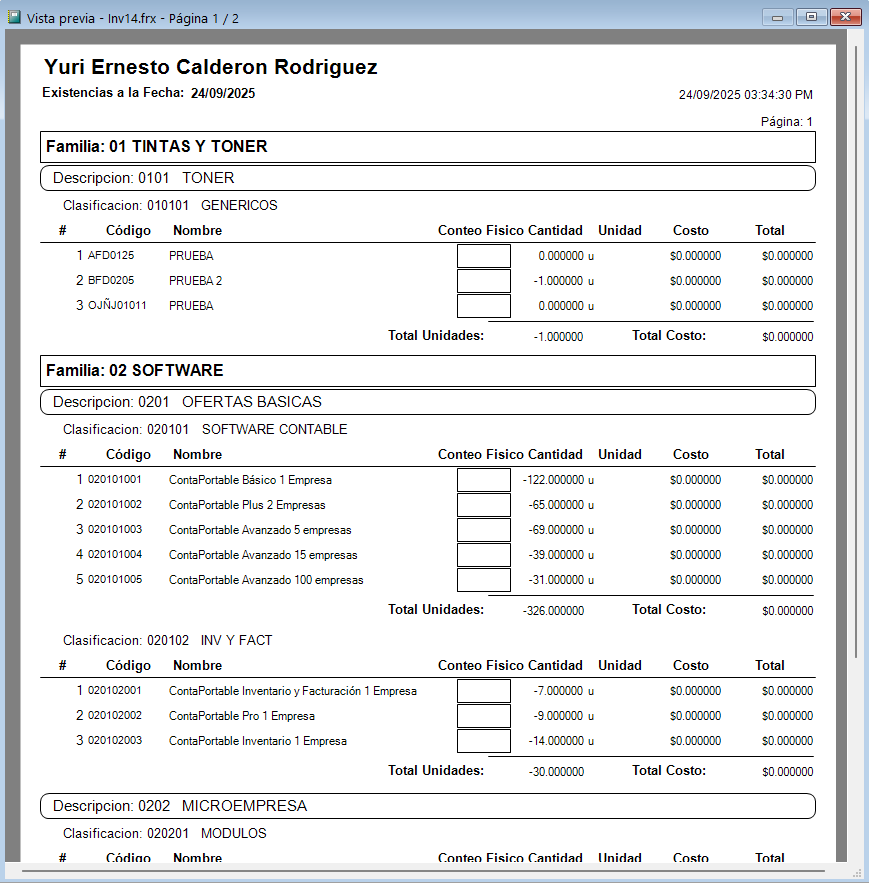{ align=left }**

??? abstract "1.2 Listado para inventario - Descargas de ejemplo"
    - **[Descargar versión PDF :fontawesome-regular-file-pdf:](../../assets/reportes/inventario/1.2-INVENTORY-LIST-REPORT.PDF){ .md-button }**
    - **[Descargar versión Excel (Consolidado) :material-microsoft-excel:](../../assets/reportes/inventario/1.2-INVENTORY-LIST-REPORT_Con.xlsx){ .md-button }**
    - **[Descargar versión Excel (Plano) :material-microsoft-excel:](../../assets/reportes/inventario/1.2-INVENTORY-LIST-REPORT_Pln.xlsx){ .md-button }**

Puedes encontrar más información en el sitio oficial de **ContaPortable** **[Enlace en sitio ContaPortable :material-web:](https://www.contaportable.com/indice/vip-modulo-contable-reportes-contables/reporte-inventario-y-facturacion/#existencia){ .md-button align=left }**

---
### 1.3  Listado por categorías

**ERROR 404 - NOT FOUND**

      **[Enlace en sitio ContaPortable :material-web:](https://www.contaportable.com/indice/vip-modulo-contable-reportes-contables/reporte-inventario-y-facturacion/#existencia){ .md-button }**

---
### 1.4  Salidas por clientes

!!! info "Descripción del reporte"
    Este reporte muestra las salidas de inventario agrupadas por cliente y únicamente se exporta a formato Excel, ya sea de forma consolidada o detallada (Plano), puede ser filtrado por medio de los siguientes parámetros:

    - Rango de fechas
    - Código (Todos o bloques)
    - Bodega
    - Departamento

Vista previa del reporte **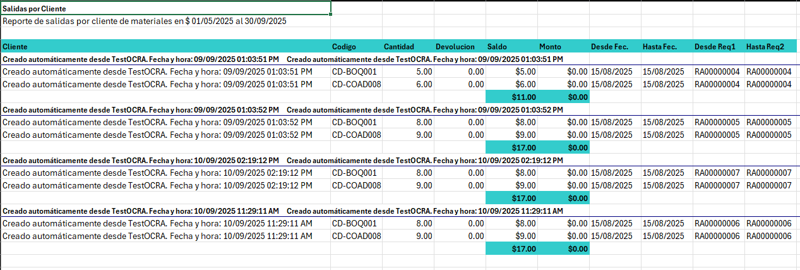{ align=left }**

??? abstract "1.4 Salidas por clientes - Descargas de ejemplo"
    - **[Descargar versión Excel (Consolidado) :material-microsoft-excel:](../../assets/reportes/inventario/1.4-SALES-BY-CUSTOMER_CON.xlsx){ .md-button }**
    - **[Descargar versión Excel (Plano) :material-microsoft-excel:](../../assets/reportes/inventario/1.4-SALES-BY-CUSTOMER_PLN.xlsx){ .md-button }**

---
### 1.5  Existencias (Alerta de mínimos)

!!! info "Descripción del reporte"
    Este reporte muestra un formato que sirve como alerta de mínimos y máximos de existencias configuradas para los códigos de inventario, puede ser filtrado por medio de los siguientes parámetros:

    - Fecha
    - Código (Todos o bloques)
    - Bodega 

    Es posible exportarlo a formato Excel, ya sea de forma consolidada o detallada (Plano).

Vista previa del reporte **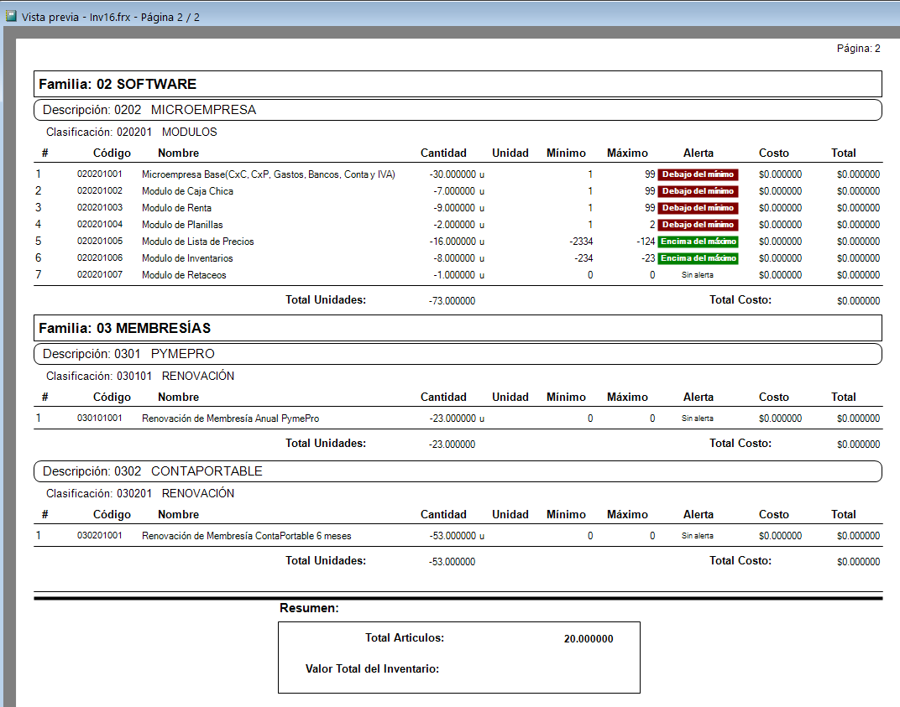{ align=left }**

??? abstract "1.5 Existencias (Alerta de mínimos) - Descargas de ejemplo"
    - **[Descargar versión PDF :fontawesome-regular-file-pdf:](../../assets/reportes/inventario/1.5_EXISTENCES_MIN_ALERT.PDF){ .md-button }**
    - **[Descargar versión Excel (Consolidado) :material-microsoft-excel:](../../assets/reportes/inventario/1.5_EXISTENCES_MIN_ALERT_CON.xlsx){ .md-button }**
    - **[Descargar versión Excel (Plano) :material-microsoft-excel:](../../assets/reportes/inventario/1.5_EXISTENCES_MIN_ALERT_PLN.xlsx){ .md-button }**

---

## **2. Documentos de inventario**

<!-- Se agrega el código mermaid para diagramar el listado de reportes dentro de la subcategoría de documentos de inventario -->
!!! tip "Diagrama de los reportes contenidos en la subcategoría **Documentos de inventario**"
    ``` mermaid
    graph LR
      A[Documentos de inventario]:::root

      subgraph "Listado de reportes:"

        B[2.1 Movimientos en ordenes de compra]
        C[2.2 Requisiciones]
        D[2.3 Ordenes de compra por proyectos]

      end

      A --> B
      A --> C
      A --> D

    click B "#21-movimientos-en-ordenes-de-compra" "Ir a reporte de movimientos en ordenes de compra"
    click C "#22-requisiciones" "Ir a reporte de requisiciones"
    click D "#23-ordenes-de-compra-por-proyecto" "Ir a reporte de ordenes de compra por proyecto"
    ```
---

### 2.1 Movimientos en ordenes de compra

!!! info "Descripción del reporte"
    Este reporte muestra un formato que contiene los movimientos relacionados a las ordenes de compra, puede ser filtrado por medio de los siguientes parámetros:

    - Fecha
    - Código (Todos o bloques)
    - Bodega
    - Departamento

    Es posible exportarlo a formato Excel, ya sea de forma consolidada o detallada (Plano).

Vista previa del reporte **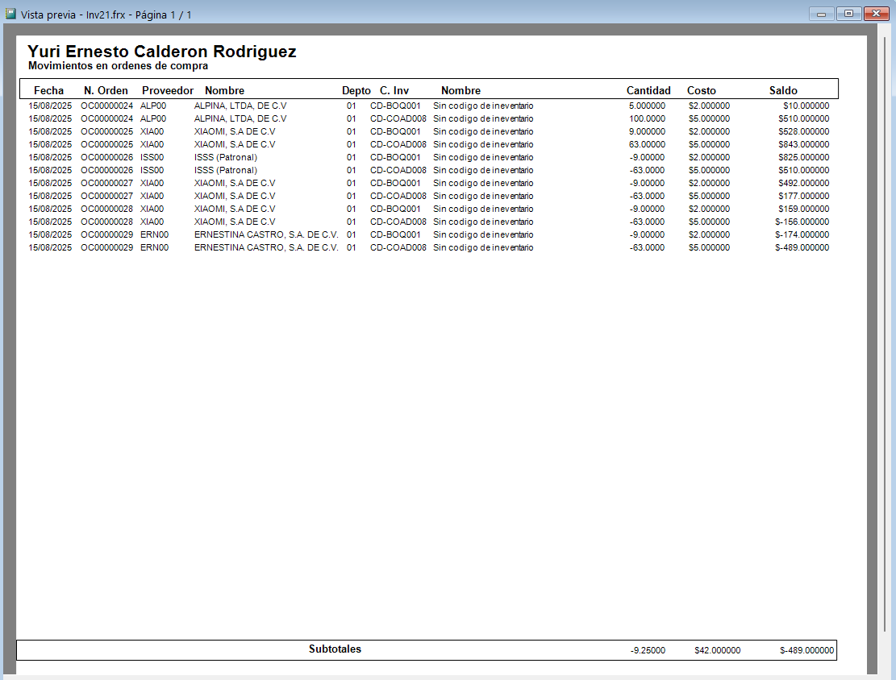{ align=left }**

??? abstract "2.1 Movimientos en ordenes de compra - Descargas de ejemplo"
    - **[Descargar versión PDF :fontawesome-regular-file-pdf:](../../assets/reportes/inventario/2.1-PURCHASES-ORDER-MOVEMENTS.PDF){ .md-button }**
    - **[Descargar versión Excel (Consolidado) :material-microsoft-excel:](../../assets/reportes/inventario/2.1-PURCHASES-ORDER-MOVEMENTS_CON.xlsx){ .md-button }**
    - **[Descargar versión Excel (Plano) :material-microsoft-excel:](../../assets/reportes/inventario/2.1-PURCHASES-ORDER-MOVEMENTS_PLN.xlsx){ .md-button }**

Puedes encontrar más información en el sitio oficial de **ContaPortable** **[Enlace en sitio ContaPortable :material-web:](https://www.contaportable.com/indice/vip-modulo-contable-reportes-contables/reporte-inventario-y-facturacion/#existencia){ .md-button align=left }**

---
### 2.2 Requisiciones

!!! info "Descripción del reporte"
    Este reporte muestra un formato que contiene los movimientos relacionados a  las requisiciones, puede ser filtrado por medio de los siguientes parámetros:

    - Fecha
    - Código (Todos o bloques)
    - Bodega
    - Departamento

    Es posible exportarlo a formato Excel, ya sea de forma consolidada o detallada (Plano).

Vista previa del reporte **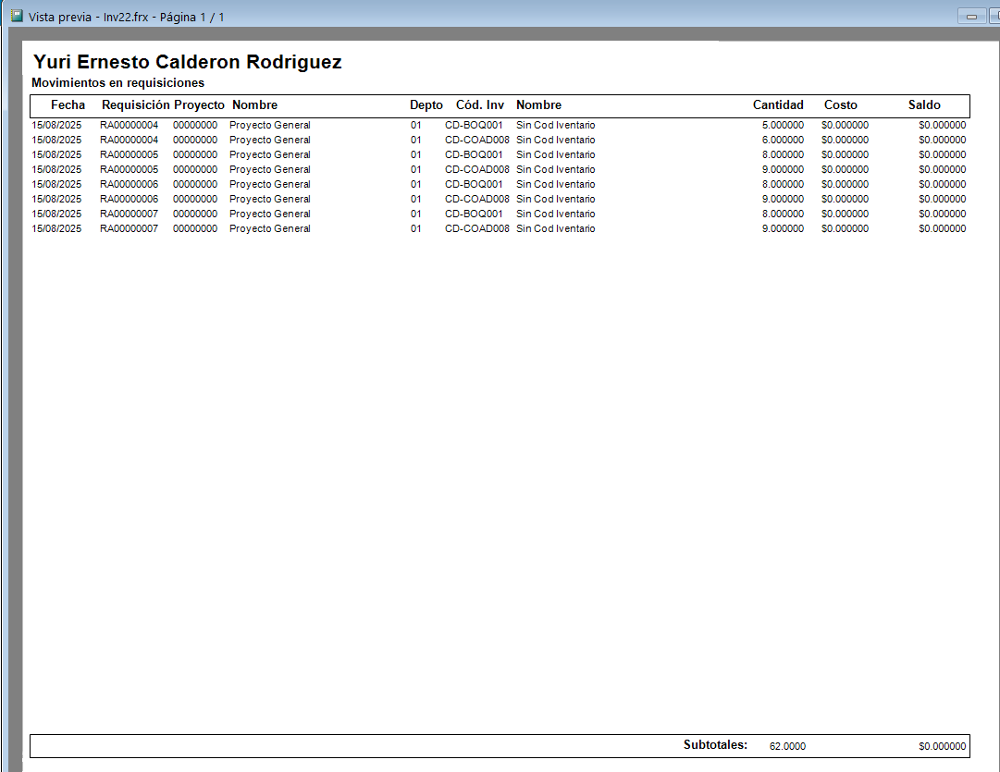{ align=left }**

??? abstract "2.2 Movimientos en requisiciones - Descargas de ejemplo"
    - **[Descargar versión PDF :fontawesome-regular-file-pdf:](../../assets/reportes/inventario/2.2-REQUEST-MOVEMENTS.PDF){ .md-button }**
    - **[Descargar versión Excel (Consolidado) :material-microsoft-excel:](../../assets/reportes/inventario/2.2-REQUEST-MOVEMENTS_CON.xlsx){ .md-button }**
    - **[Descargar versión Excel (Plano) :material-microsoft-excel:](../../assets/reportes/inventario/2.2-REQUEST-MOVEMENTS_PLN.xlsx){ .md-button }**

Puedes encontrar más información en el sitio oficial de **ContaPortable** **[Enlace en sitio ContaPortable :material-web:](https://www.contaportable.com/indice/vip-modulo-contable-reportes-contables/reporte-inventario-y-facturacion/#existencia){ .md-button align=left }**

---
### 2.3 Ordenes de compra por proyecto

!!! info "Descripción del reporte"
    Este reporte muestra un formato que contiene los movimientos relacionados a las ordenes de compra por proyecto, puede ser filtrado por medio de los siguientes parámetros:

    - Fecha
    - Código (Todos o bloques)
    - Bodega
    - Departamento

    Es posible exportarlo a formato Excel, ya sea de forma detallada (Plano).

Vista previa del reporte **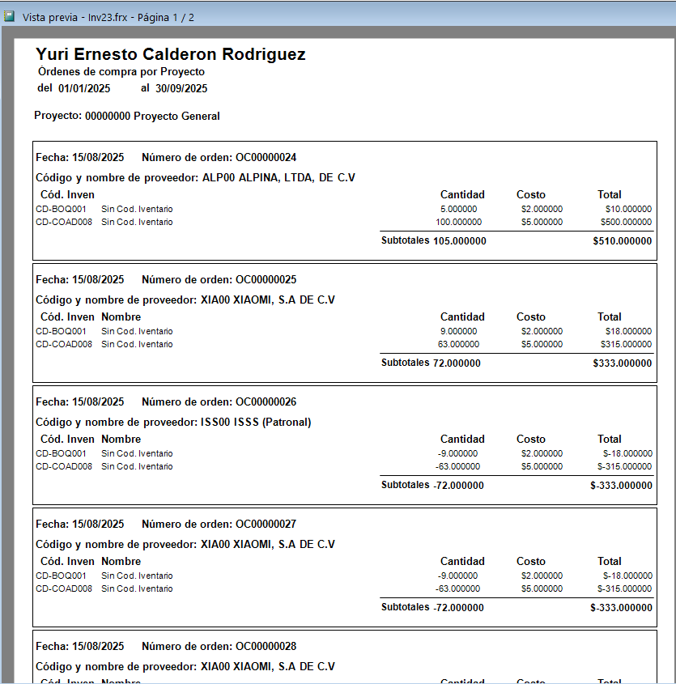{ align=left }**

??? abstract "2.3 Movimientos en ordenes de compra por proyecto - Descargas de "
    - **[Descargar versión PDF :fontawesome-regular-file-pdf:](../../assets/reportes/inventario/2.3-PURCHASES-ORDER-MOVEMENTS-BY-PROJECT.PDF){ .md-button }**
    - **[Descargar versión Excel (Detallado) :material-microsoft-excel:](../../assets/reportes/inventario/2.3-PURCHASES-ORDER-MOVEMENTS-BY-PROJECT.xlsx){ .md-button }**

Puedes encontrar más información en el sitio oficial de **ContaPortable** **[Enlace en sitio ContaPortable :material-web:](https://www.contaportable.com/indice/vip-modulo-contable-reportes-contables/reporte-inventario-y-facturacion/#existencia){ .md-button align=left }**

---

## **3. Inventario costeados**

<!-- Se agrega el código mermaid para diagramar el listado de reportes dentro de la subcategoría de reportes de inventario costeados -->
!!! tip "Diagrama de los reportes contenidos en la subcategoría **Reportes de inventario costeados**"
    ``` mermaid
    graph LR
      A[Reportes de inventario costeados]:::root

      subgraph "Listado de reportes:"

        B[3.1 Existencias]
        C[3.2 Movimientos]
        D[3.3 Entradas]
        E[3.4 Salidas]
        F[3.5 Análisis de inventario]
        G[3.6 Resumen de movimientos]
        H[3.7 Movimientos - incluye el lote y fecha de vencimiento]
        I[3.8 Movimientos de Kardex]
      end

      A --> B
      A --> C
      A --> D
      A --> E
      A --> F
      A --> G
      A --> H
      A --> I

    click B "#31-existencias" "Ir a reporte de existencias de inventario costeado"
    click C "#32-movimientos" "Ir a reporte de movimientos"
    click D "#33-entradas" "Ir a reporte de entradas"
    click E "#34-salidas" "Ir a reporte de salidas"
    click F "#35-analisis-de-inventario" "Ir a reporte de análisis de inventario"
    click G "#36-resumen-de-movimientos" "Ir a reporte de resumen de movimientos"
    click H "#37-movimientos-incluye-lote-y-fecha-de-vencimiento" "Ir a reporte de movimientos (incluye lote y fecha de vencimiento)"
    click I "#38-movimientos-de-kardex" "Ir a reporte de movimientos de kardex"
    ```
---

### 3.1 Existencias

!!! info "Descripción del reporte"
    Este reporte muestra un formato que contiene las existencias por inventario costeado, puede ser filtrado por medio de los siguientes parámetros:

    - Fecha
    - Código (Todos o bloques)
    - Incluir recetas y kits

    Es posible exportarlo a formato Excel, ya sea de forma consolidada o detallada (Plano).

Vista previa del reporte **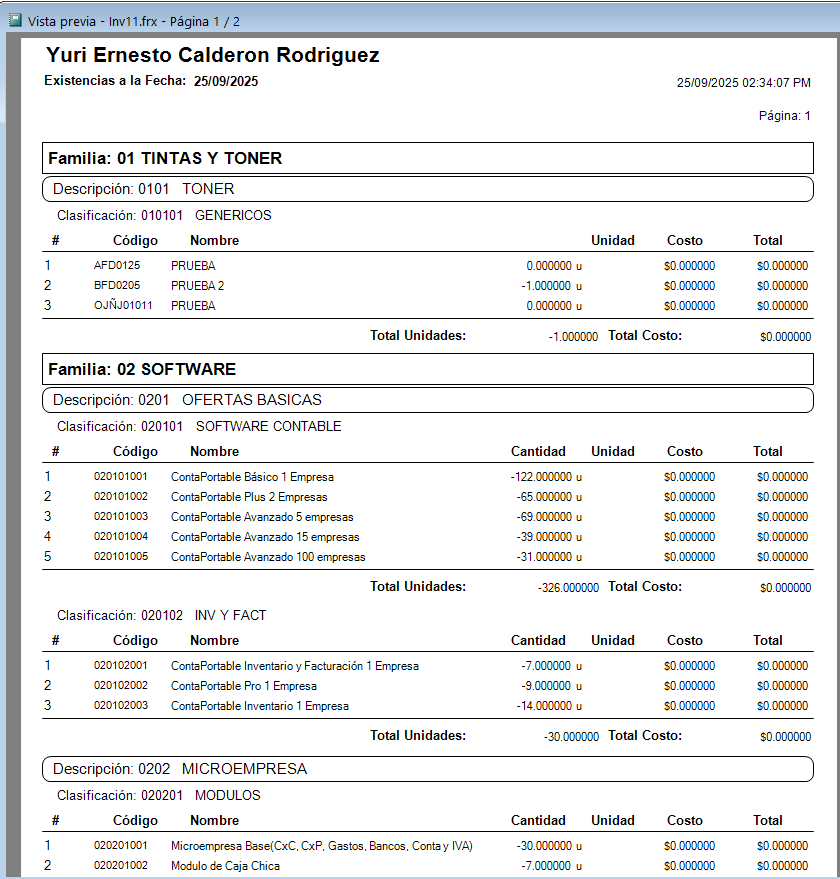{ align=left }**

??? abstract "3.1 Existencias de inventario costeado - Descargas de ejemplo"
    - **[Descargar versión PDF :fontawesome-regular-file-pdf:](../../assets/reportes/inventario/3.1-EXISTENCES-REPORT.PDF){ .md-button }**
    - **[Descargar versión Excel (Consolidado) :material-microsoft-excel:](../../assets/reportes/inventario/3.1-EXISTENCES-REPORT_CON.xlsx){ .md-button }**
    - **[Descargar versión Excel (Plano) :material-microsoft-excel:](../../assets/reportes/inventario/3.1-EXISTENCES-REPORT_PLN.xlsx){ .md-button }**

Puedes encontrar más información en el sitio oficial de **ContaPortable** **[Enlace en sitio ContaPortable :material-web:](https://www.contaportable.com/indice/vip-modulo-contable-reportes-contables/reporte-inventario-y-facturacion/#existencia){ .md-button align=left }**

---

### 3.2 Movimientos

!!! info "Descripción del reporte"
    Este reporte muestra un formato que contiene los movimientos de inventario costeado, puede ser filtrado por medio de los siguientes parámetros:

    - Fecha
    - Código (Todos o bloques)
    - Incluir o no recetas y kits

    Es posible exportarlo a formato Excel, ya sea de forma consolidada o detallada (Plano).

Vista previa del reporte **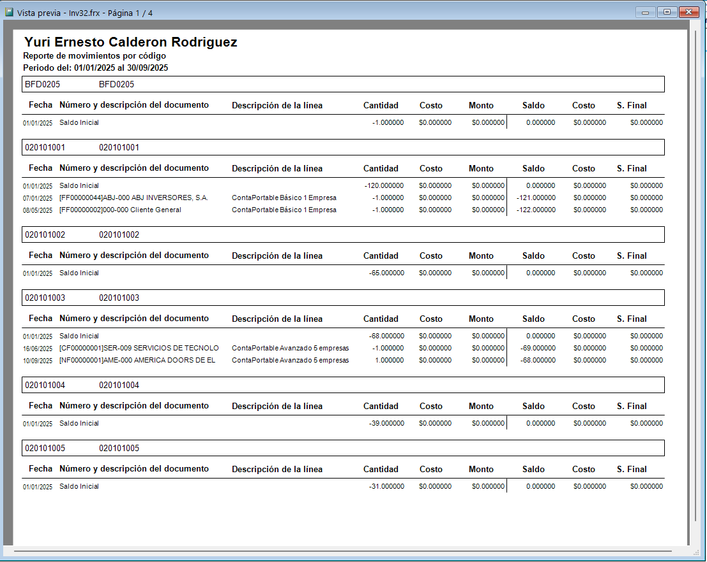{ align=left }**

??? abstract "3.2 Movimientos de inventario costeado - Descargas de ejemplo"
    - **[Descargar versión PDF :fontawesome-regular-file-pdf:](../../assets/reportes/inventario/3.2-MOVEMENTS-REPORT.PDF){ .md-button }**
    - **[Descargar versión Excel (Consolidado) :material-microsoft-excel:](../../assets/reportes/inventario/3.2-MOVEMENTS-REPORT_CON.XLSX){ .md-button }**
    - **[Descargar versión Excel (Plano) :material-microsoft-excel:](../../assets/reportes/inventario/3.2-MOVEMENTS-REPORT_PLN.XLSX){ .md-button }**

Puedes encontrar más información en el sitio oficial de **ContaPortable** **[Enlace en sitio ContaPortable :material-web:](https://www.contaportable.com/indice/vip-modulo-contable-reportes-contables/reporte-inventario-y-facturacion/#existencia){ .md-button align=left }**

---

### 3.3 Entradas

!!! info "Descripción del reporte"
    Este reporte muestra un formato que contiene las entradas de inventario, puede ser filtrado por medio de los siguientes parámetros:

    - Fecha
    - Código (Todos o bloques)
    - Incluir o no recetas y kits

    Es posible exportarlo a formato Excel, ya sea de forma consolidada o detallada (Plano).

Vista previa del reporte **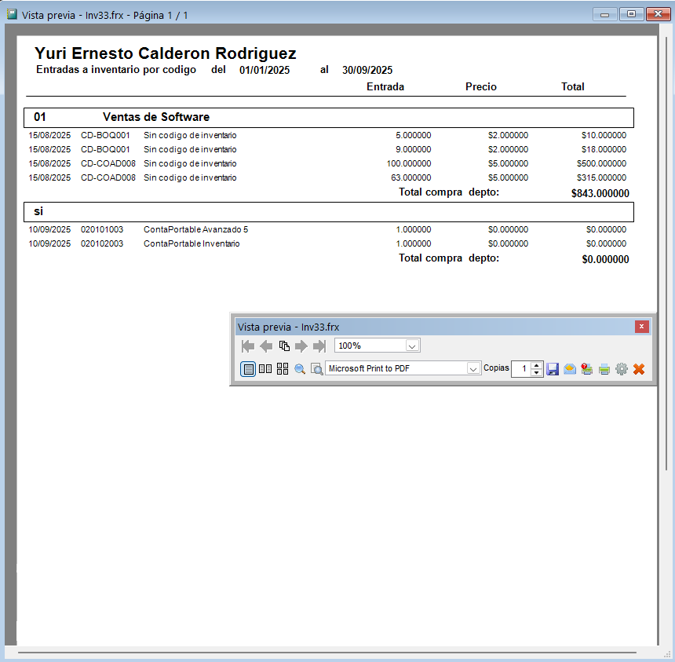{ align=left }**

??? abstract "3.3 Entradas de inventario costeado - Descargas de ejemplo"
    - **[Descargar versión PDF :fontawesome-regular-file-pdf:](../../assets/reportes/inventario/3.3-ENTRIES-REPORT.PDF){ .md-button }**
    - **[Descargar versión Excel (Consolidado) :material-microsoft-excel:](../../assets/reportes/inventario/3.3-ENTRIES-REPORT_CON.XLSX){ .md-button }**
    - **[Descargar versión Excel (Plano) :material-microsoft-excel:](../../assets/reportes/inventario/3.3-ENTRIES-REPORT_PLN.XLSX){ .md-button }**

Puedes encontrar más información en el sitio oficial de **ContaPortable** **[Enlace en sitio ContaPortable :material-web:](https://www.contaportable.com/indice/vip-modulo-contable-reportes-contables/reporte-inventario-y-facturacion/#existencia){ .md-button align=left }**

---

### 3.4 Salidas

!!! info "Descripción del reporte"
    Este reporte muestra un formato que contiene las salidas de inventario, puede ser filtrado por medio de los siguientes parámetros:

    - Fecha
    - Código (Todos o bloques)
    - Incluir o no recetas y kits

    Es posible exportarlo a formato Excel, ya sea de forma consolidada o detallada (Plano).

Vista previa del reporte **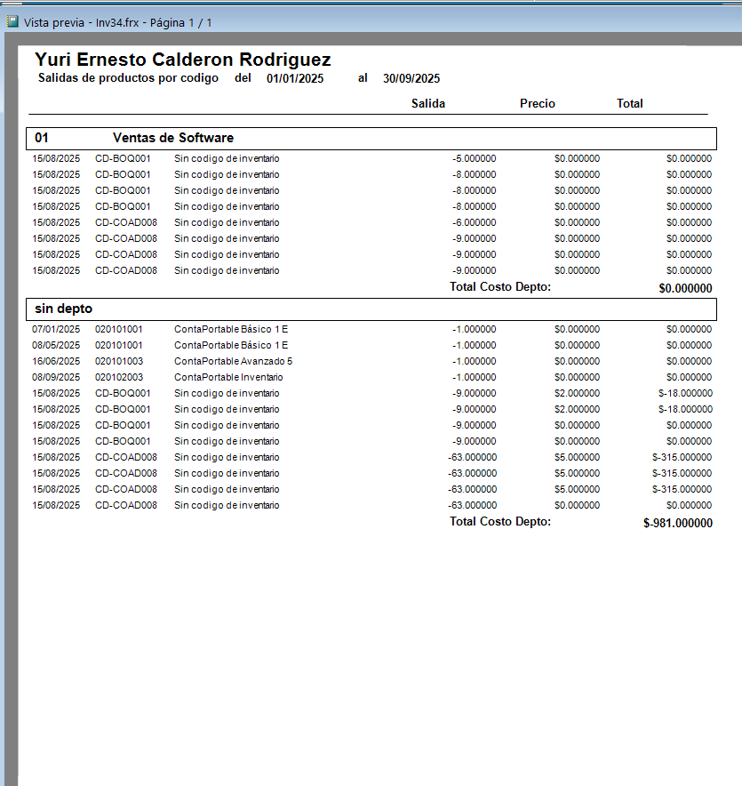{ align=left }**

??? abstract "3.4 Salidas de inventario costeado - Descargas de ejemplo"
    - **[Descargar versión PDF :fontawesome-regular-file-pdf:](../../assets/reportes/inventario/3.4-OUTGOINGS-REPORT.PDF){ .md-button }**
    - **[Descargar versión Excel (Consolidado) :material-microsoft-excel:](../../assets/reportes/inventario/3.4-OUTGOINGS-REPORT_CON.XLSX){ .md-button }**
    - **[Descargar versión Excel (Plano) :material-microsoft-excel:](../../assets/reportes/inventario/3.4_OUTGOINGS_REPORT_PLN.xlsx){ .md-button }**

Puedes encontrar más información en el sitio oficial de **ContaPortable** **[Enlace en sitio ContaPortable :material-web:](https://www.contaportable.com/indice/vip-modulo-contable-reportes-contables/reporte-inventario-y-facturacion/#existencia){ .md-button align=left }**

---

### 3.5 Análisis de inventario

!!! info "Descripción del reporte"
    Este reporte muestra un formato que es únicamente exportable a Excel que contiene un análisis de inventario, puede ser filtrado por medio de los siguientes parámetros:

    - Fecha
    - Código (Todos o bloques)
    - Incluir o no recetas y kits

Vista previa del reporte **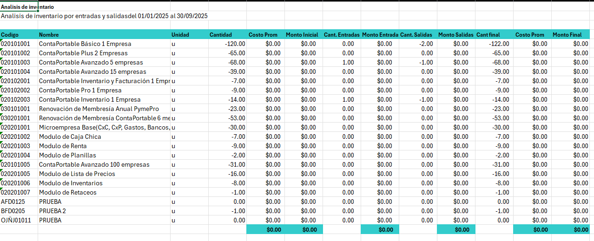{ align=left }**

??? abstract "3.5 Análisis de inventario costeado - Descargas de ejemplo"
    - **[Descargar versión Excel (Detallado) :material-microsoft-excel:](../../assets/reportes/inventario/3.5-Inventory-analisis.xlsx){ .md-button }**

Puedes encontrar más información en el sitio oficial de **ContaPortable** **[Enlace en sitio ContaPortable :material-web:](https://www.contaportable.com/indice/vip-modulo-contable-reportes-contables/reporte-inventario-y-facturacion/#existencia){ .md-button align=left }**

---

### 3.6 Resumen de movimientos

!!! info "Descripción del reporte"
    Este reporte muestra un formato que contiene el resumen de movimientos inventario, puede ser filtrado por medio de los siguientes parámetros:

    - Fecha
    - Código (Todos o bloques)
    - Incluir o no recetas y kits

    Es posible exportarlo a formato Excel, ya sea de forma consolidada o detallada (Plano).

Vista previa del reporte **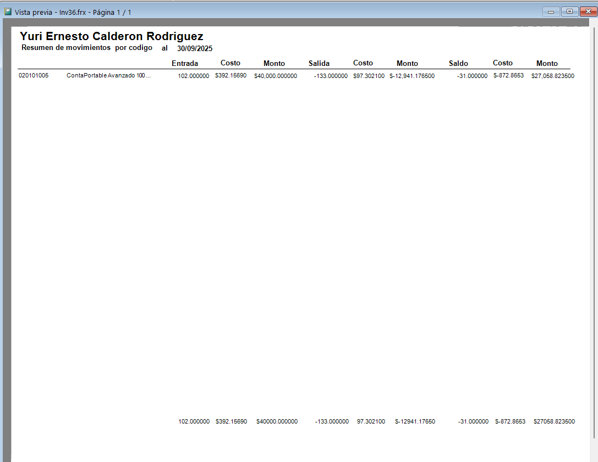{ align=left }**

??? abstract "3.6 Resumen de movimientos de inventario costeado - Descargas de ejemplo"
    - **[Descargar versión PDF :fontawesome-regular-file-pdf:](../../assets/reportes/inventario/3.6-MOVEMENTS-7SUMMARY-REPORT.PDF){ .md-button }**
    - **[Descargar versión Excel (Consolidado) :material-microsoft-excel:](../../assets/reportes/inventario/3.6-MOVEMENTS-SUMMARY-REPORT-CON.xlsx){ .md-button }**
    - **[Descargar versión Excel (Plano) :material-microsoft-excel:](../../assets/reportes/inventario/3.6-MOVEMENTS-SUMMARY-REPORT-PLN.xlsx){ .md-button }**

Puedes encontrar más información en el sitio oficial de **ContaPortable** **[Enlace en sitio ContaPortable :material-web:](https://www.contaportable.com/indice/vip-modulo-contable-reportes-contables/reporte-inventario-y-facturacion/#existencia){ .md-button align=left }**

---

### 3.7 Movimientos (Incluye lote y fecha de vencimiento)

!!! info "Descripción del reporte"
    Este reporte muestra un formato que contiene los movimientos de inventario que incluye el lote y fecha de vencimiento, puede ser filtrado por medio de los siguientes parámetros:

    - Fecha
    - Código (Todos o bloques)
    - Incluir o no recetas y kits

    Es posible exportarlo a formato Excel, ya sea de forma consolidada o detallada (Plano).

Vista previa del reporte **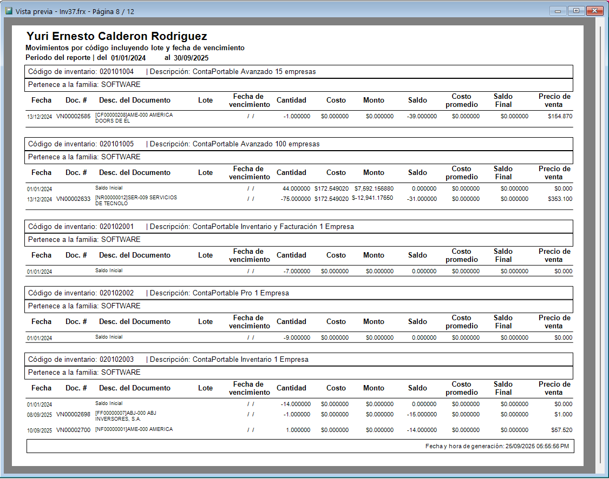{ align=left }**

??? abstract "3.7 Reporte de movimientos de inventario costeado (Incluye el lote y fecha de vencimiento) - Descargas de ejemplo"
    - **[Descargar versión PDF :fontawesome-regular-file-pdf:](../../assets/reportes/inventario/3.7-MOVEMENTS-EXPIRE-DATE-REPORT.PDF){ .md-button }**
    - **[Descargar versión Excel (Consolidado) :material-microsoft-excel:](../../assets/reportes/inventario/3.7-MOVEMENTS_EXPIRE-DATE_CON.xlsx){ .md-button }**
    - **[Descargar versión Excel (Plano) :material-microsoft-excel:](../../assets/reportes/inventario/3.7-MOVEMENTS_EXPIRE-DATE_PLN.xlsx){ .md-button }**

Puedes encontrar más información en el sitio oficial de **ContaPortable** **[Enlace en sitio ContaPortable :material-web:](https://www.contaportable.com/indice/vip-modulo-contable-reportes-contables/reporte-inventario-y-facturacion/#existencia){ .md-button align=left }**

---

### 3.8 Movimientos de Kardex

!!! info "Descripción del reporte"
    Este reporte muestra un formato que contiene los movimientos de inventario de kardex, puede ser filtrado por medio de los siguientes parámetros:

    - Fecha
    - Código (Todos o bloques)
    - Incluir o no recetas y kits

    Es posible exportarlo a formato Excel, ya sea de forma consolidada o detallada (Plano).

Vista previa del reporte **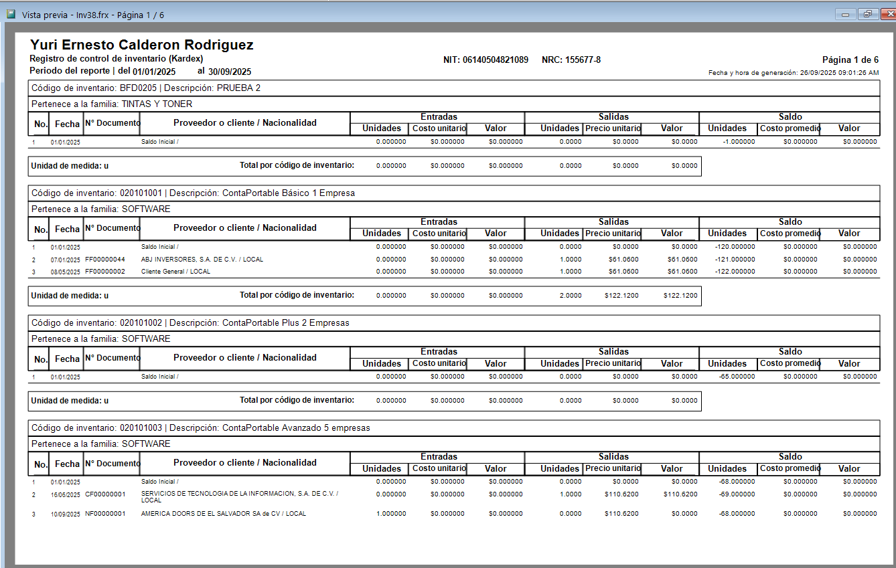{ align=left }**

??? abstract "3.8 Reporte de movimientos de Kardex - Descargas de ejemplo"
    - **[Descargar versión PDF :fontawesome-regular-file-pdf:](../../assets/reportes/inventario/3.8-KARDEX-MOVEMENTS-REPORT.PDF){ .md-button }**
    - **[Descargar versión Excel (Consolidado) :material-microsoft-excel:](../../assets/reportes/inventario/3.8-KARDEX-MOVEMENTS-REPORT_CON.xlsx){ .md-button }**
    - **[Descargar versión Excel (Plano) :material-microsoft-excel:](../../assets/reportes/inventario/3.8-KARDEX-MOVEMENTS-REPORT_PLN.xlsx){ .md-button }**

Puedes encontrar más información en el sitio oficial de **ContaPortable** **[Enlace en sitio ContaPortable :material-web:](https://www.contaportable.com/indice/vip-modulo-contable-reportes-contables/reporte-inventario-y-facturacion/#existencia){ .md-button align=left }**

---

## **4. Por marca y modelo**

<!-- Se agrega el código mermaid para diagramar el listado de reportes dentro de la subcategoría de reportes de inventario costeados -->
!!! tip "Diagrama de los reportes contenidos en la subcategoría **Reportes de inventario costeados**"
    ``` mermaid
    graph LR
      A[Reportes de inventario costeados]:::root

      subgraph "Listado de reportes:"

        B[4.1 Movimientos de inventario por marca y modelo]
        C[4.2 Movimientos de inventario por marca y modelo - incluye lote y fecha de vencimiento]
      end

      A --> B
      A --> C

    click B "#41-movimientos-de-inventario-por-marca-y-modelo" "Ir a reporte de movimientos de inventario por marca y modelo"
    click C "#42-movimientos-de-inventario-por-marca-y-modelo-incluye-lote-y-fecha-de-vencimiento" "Ir a reporte de movimientos de inventario por marca y modelo (Incluye marca y modelo)"
    
    ```
---
    
!!! abstract "Filtros por marca y modelo"
    En esta categoría en particular se encuentran añadidos dos contenedores de filtros por marca y modelo, con los cuales se pueden establecer bloques de marcas y modelos para incluir en el reporte.

    **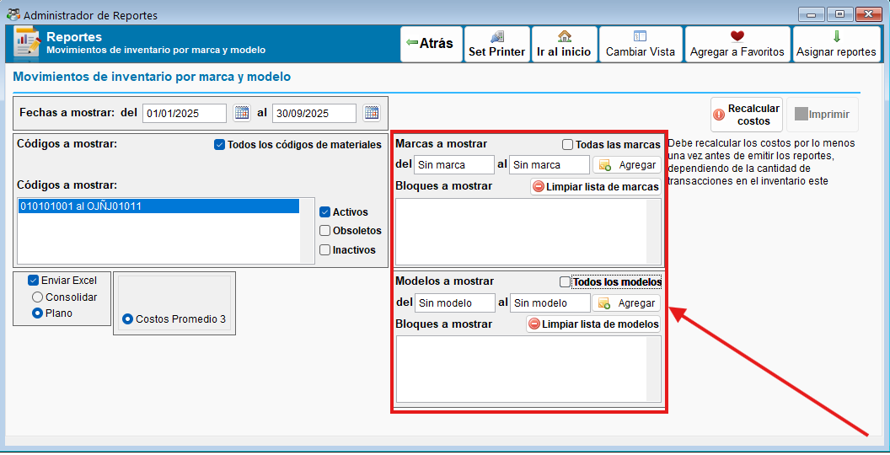{ align=left }**

---

### 4.1 Movimientos de inventario por marca y modelo

!!! info "Descripción del reporte"
    Este reporte muestra un formato que contiene los movimientos de inventario agrupados por marca y modelo, puede ser filtrado por medio de los siguientes parámetros:

    - Fecha
    - Código (Todos o bloques)
    - Marcas (Todas o bloques)
    - Modelos (Todos o bloques)
    - Incluir o no recetas y kits

    Es posible exportarlo a formato Excel, ya sea de forma consolidada o detallada (Plano).

Vista previa del reporte **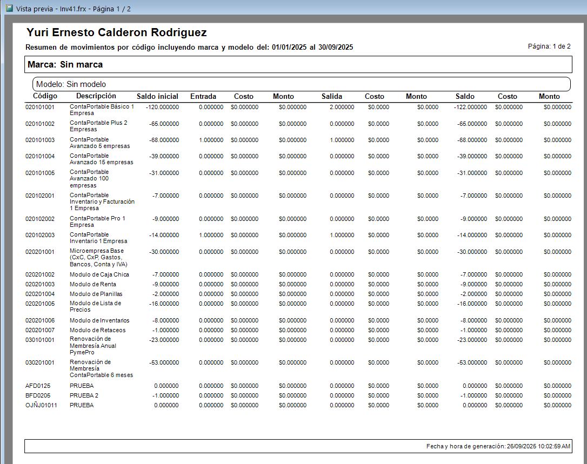{ align=left }**

??? abstract "4.1 Reporte de movimientos agrupados por marca y modelo - Descargas de ejemplo"
    - **[Descargar versión PDF :fontawesome-regular-file-pdf:](../../assets/reportes/inventario/4.1-MOVEMENTS-SUMMARY-BY-BRAND-MODEL-REPORT.PDF){ .md-button }**
    - **[Descargar versión Excel (Consolidado) :material-microsoft-excel:](../../assets/reportes/inventario/4.1-MOVEMENTS-SUMMARY-BY-BRAND-MODEL-REPORT_CON.xlsx){ .md-button }**
    - **[Descargar versión Excel (Plano) :material-microsoft-excel:](../../assets/reportes/inventario/4.1-MOVEMENTS-SUMMARY-BY-BRAND-MODEL-REPORT_PLN.xlsx){ .md-button }**

Puedes encontrar más información en el sitio oficial de **ContaPortable** **[Enlace en sitio ContaPortable :material-web:](https://www.contaportable.com/indice/vip-modulo-contable-reportes-contables/reporte-inventario-y-facturacion/#existencia){ .md-button align=left }**

---

### 4.2 Movimientos de inventario por marca y modelo (incluye lote y fecha de vencimiento)

!!! info "Descripción del reporte"
    Este reporte muestra un formato que contiene los movimientos de inventario agrupados por marca y modelo (incluye lote y fecha de vencimiento), puede ser filtrado por medio de los siguientes parámetros:

    - Fecha
    - Código (Todos o bloques)
    - Marcas (Todas o bloques)
    - Modelos (Todos o bloques)
    - Incluir o no recetas y kits

    Es posible exportarlo a formato Excel, ya sea de forma consolidada o detallada (Plano).

Vista previa del reporte **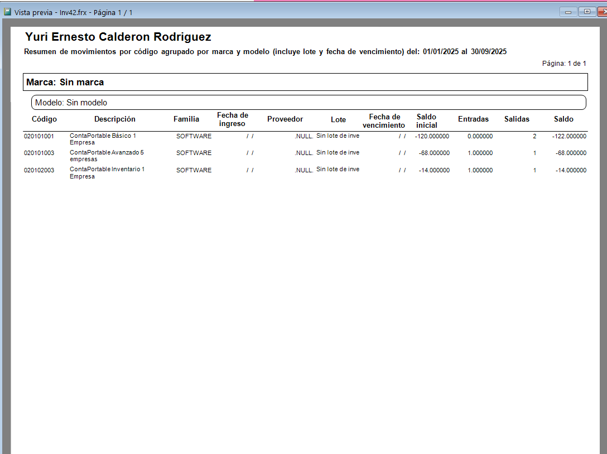{ align=left }**

??? abstract "4.2 Reporte de movimientos de inventario por marca y modelo (incluye lote y fecha de vencimiento) - Descargas de ejemplo"
    - **[Descargar versión PDF :fontawesome-regular-file-pdf:](../../assets/reportes/inventario/4.2-MOVEMENTS-SUMMARY-BY-BRAND-MODEL-EXPIRE-DATE-REPORT.PDF){ .md-button }**
    - **[Descargar versión Excel (Consolidado) :material-microsoft-excel:](../../assets/reportes/inventario/4.2-MOVEMENTS-SUMMARY-BY-BRAND-MODEL-EXPIRE-DATE-REPORT_CON.xlsx){ .md-button }**
    - **[Descargar versión Excel (Plano) :material-microsoft-excel:](../../assets/reportes/inventario/4.2-MOVEMENTS-SUMMARY-BY-BRAND-MODEL-EXPIRE-DATE-REPORT_PLN.xlsx){ .md-button }**

Puedes encontrar más información en el sitio oficial de **ContaPortable** **[Enlace en sitio ContaPortable :material-web:](https://www.contaportable.com/indice/vip-modulo-contable-reportes-contables/reporte-inventario-y-facturacion/#existencia){ .md-button align=left }**
