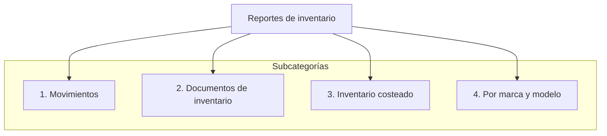

---

# Reportes de inventario

Esta página reúne el detalle de los reportes incluídos en la categoría de inventario en el sistema **ContaPortable**.

<!-- Se agrega el código mermaid para diagramar  -->

---

## **1. Movimientos**

---

### 1.1  Existencias
**[Enlace en sitio ContaPortable: :material-web:](https://www.contaportable.com/indice/vip-modulo-contable-reportes-contables/reporte-inventario-y-facturacion/#existencia){ .md-button}**

- **Imagen (Loom):** { align=left }

---

### 1.2  Listado para inventario
- ****

- **Imagen (Loom):** { align=left }

---

## **2. Documentos de inventario**

### Movimientos de inventario con lote y fecha de vencimiento
- **Video (Loom):** https://www.loom.com/i/857823073cc14e8995566696234b0647

---

## **3. Inventario costeado**

---

## **4. Por marca y modelo**

### 4.1 Reporte de inventario — Marca y modelo

> **Resumen:** Este reporte incluye selectores de **marca** y **modelo** que permiten establecer bloques (comportamiento similar a ...).  
> **Nota:** El documento original continúa con más detalles sobre el comportamiento y filtros del reporte; el texto fuente visible quedó truncado en la copia disponible. Para revisar el contenido completo remítase al archivo original. :contentReference[oaicite:2]{index=2}

---