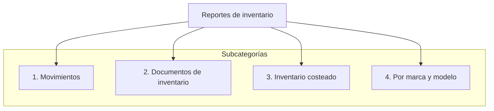

---

# Reportes de inventario

Esta página reúne el detalle de los reportes incluídos en la categoría de inventario en el sistema **ContaPortable**, comparándolos con las referencias públicas actuales del sitio web y mostrando enlaces a los videos explicativos (Loom).

<!-- Se agrega el código mermaid para diagramar  -->

## Reportes de Inventario

### Existencias
- **Enlace en sitio ContaPortable:**  
  `https://www.contaportable.com/indice/vip-modulo-contable-reportes-contables/reporte-inventario-y-facturacion/#existencia`
- **Imagen (Loom):** { align=left }

## Nuevos reportes de inventario (no publicados aún en el sitio)

> Los siguientes reportes ya fueron incluidos recientemente en el sistema, pero aún no aparecen en la documentación pública del sitio web.

### Movimientos de inventario con lote y fecha de vencimiento
- **Video (Loom):** https://www.loom.com/i/857823073cc14e8995566696234b0647

### Reporte de alerta de mínimos y máximos en inventario
- **Video (Loom):** https://www.loom.com/i/0c1dc93eec7a44bda48d52d5b6ff48fe

---

## 4.1 Reporte de inventario — Marca y modelo

> **Resumen:** Este reporte incluye selectores de **marca** y **modelo** que permiten establecer bloques (comportamiento similar a ...).  
> **Nota:** El documento original continúa con más detalles sobre el comportamiento y filtros del reporte; el texto fuente visible quedó truncado en la copia disponible. Para revisar el contenido completo remítase al archivo original. :contentReference[oaicite:2]{index=2}

---

## Observaciones y próximos pasos

- Actualizar la documentación pública del sitio web con los nuevos reportes (Movimientos con lote/ven., Alertas de mínimos/máx.).
- Añadir capturas o enlaces a los Loom en la sección correspondiente del sitio para facilitar la referencia.
- Completar la sección **4.1** (Marca y modelo) con la descripción completa de filtros, ejemplos de uso y capturas de pantalla desde el sistema.

---

## Referencias
- Documento fuente: *Cambios en reportes.docx*. :contentReference[oaicite:3]{index=3}
- Enlaces Loom incluidos en cada sección.

